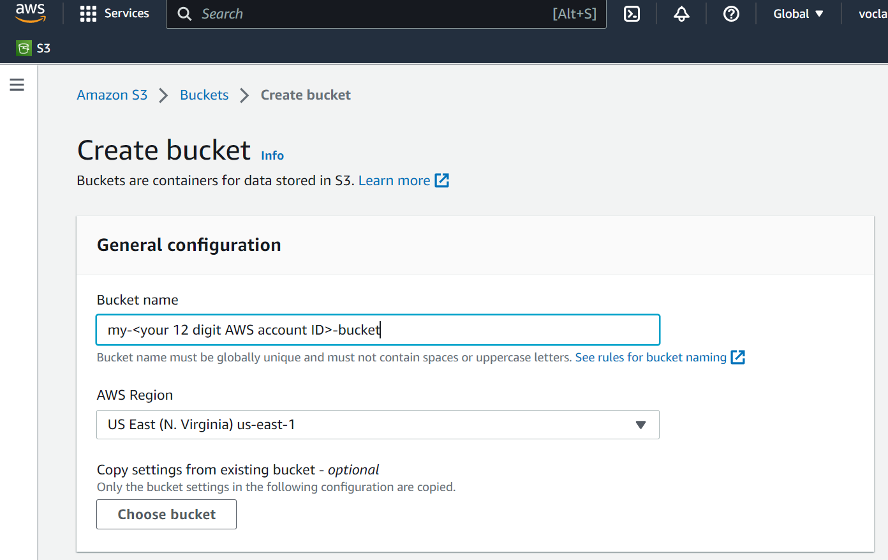
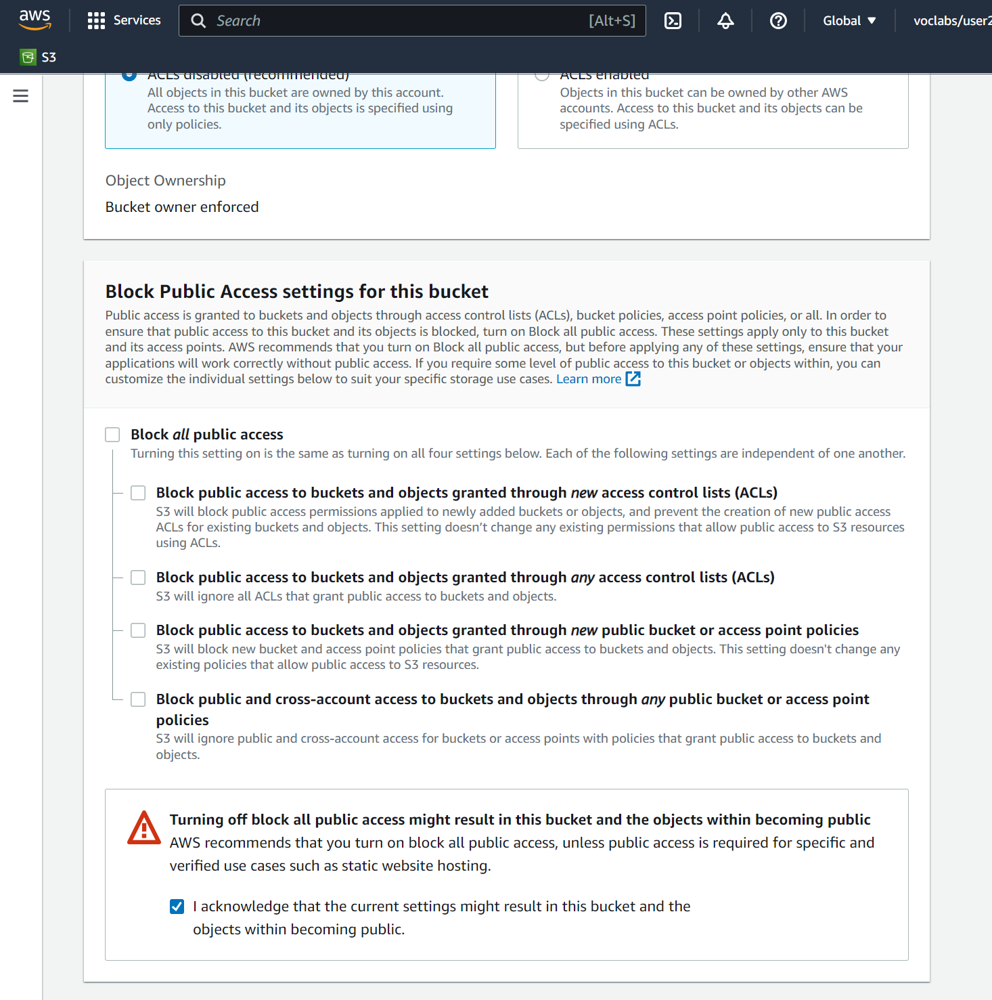
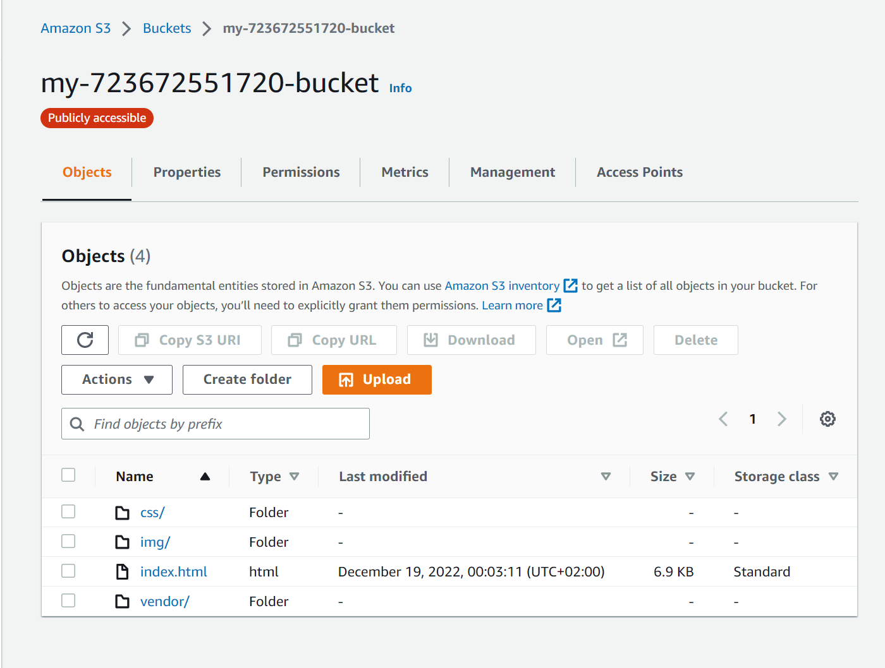
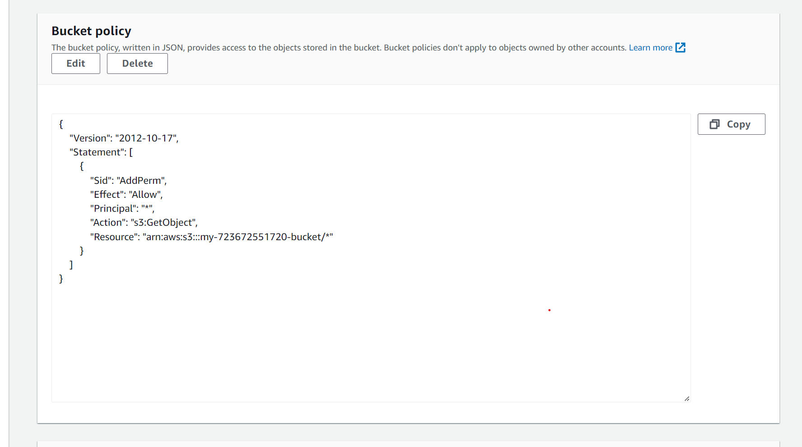
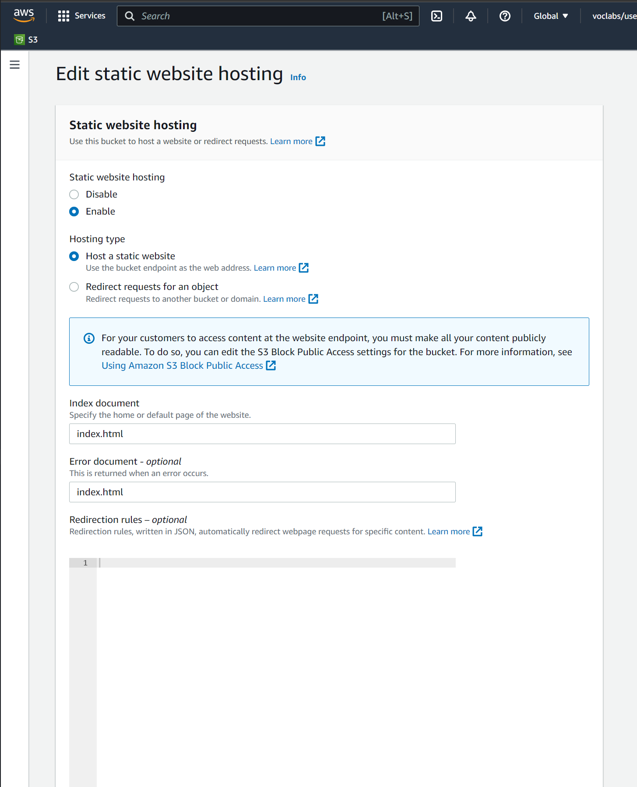
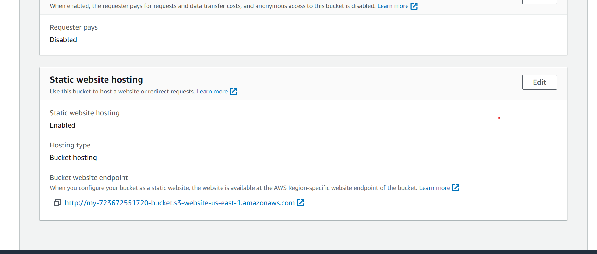
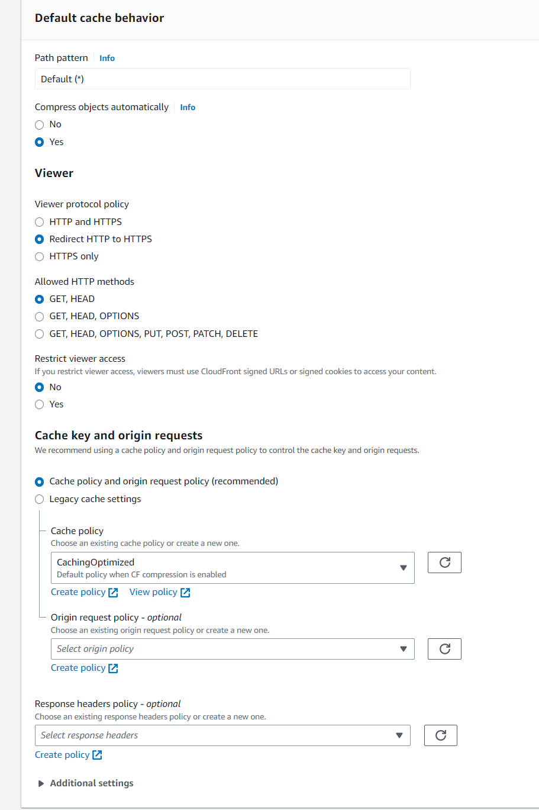
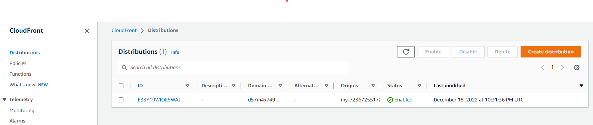

# Deploy Static Website on AWS

In this project, a static website is deployed to AWS using S3, CloudFront, and IAM.

**Live Demo:** [GitHub Pages](https://mohammmeddawood.github.io/deploy-a-static-website-on-aws/) | [AWS CloudFront](https://d57m4x749ljme.cloudfront.net/) | [AWS S3 Bucket](https://my-723672551720-bucket.s3.amazonaws.com/index.html)

**Note:** Website can be accessed through AWS with limited access. (29/11/2021)

## Table of Content

1. [Project Structure](#project-structure)
2. [Access Website in Web Browser](#access-website-in-web-browser)
3. [Getting Started](#getting-started)
   1. [Create S3 Bucket](#create-s3-bucket)
   2. [Upload files to S3 bucket](#upload-files-to-s3-bucket)
   3. [Secure Bucket via IAM](#secure-bucket-via-iam)
   4. [Configure S3 Bucket](#configure-s3-bucket)
   5. [Distribute Website via CloudFront](#distribute-website-via-cloudfront)

## Project Structure

| Project Item | Description                                                                                 |
| ------------ | ------------------------------------------------------------------------------------------- |
| index.html   | The Index document for the website.                                                         |
| /img         | The background image file for the website.                                                  |
| /vendor      | Bootssrap CSS framework, Font, and JavaScript libraries needed for the website to function. |
| /css         | CSS files for the website.                                                                  |

## Access Website in Web Browser

There are three ways to access the bucket:

| Source           | URL                                                               | Screenshot                                           |
| ---------------- | ----------------------------------------------------------------- | ---------------------------------------------------- |
| CloudFront       | https://d57m4x749ljme.cloudfront.net/                             | [Click to view](docs/images/web-home-cloudfront.png) |
| Website Endpoint | http://my-723672551720-bucket.s3-website.us-east-1.amazonaws.com/ | [Click to view](docs/images/web-home-endpoint.png)   |
| S3 Object URL    | https://my-723672551720-bucket.s3.amazonaws.com/index.html        | [Click to view](docs/images/web-home-s3.png)         |

## Getting Started

### Create S3 Bucket

1. Go to Amazon S3
2. Click on "Create Bucket"
3. Specify Bucket Name, e.g. "my-<your 12 digit AWS account ID>-bucket"
   
4. Allow Public Access to the Bucket
   1. Uncheck "Block all public access"
   2. Check "I acknowledge that the current settings might result in this bucket..."
      

### Upload files to S3 bucket

1. Click on "Upload files"
2. Click on "Add files" to select "index.html"
3. Click on "Add folders" to select "css", "img", and "vendor"
4. Check selected files and proceed to upload
   

### Secure Bucket via IAM

1. Click on "Permissions" tab
2. Click on "Edit" button in "Bucket policy"
3. Copy content of [bucketPolicy.json](docs/bucketPolicy.json) and paste it
4. Click on "Save"
   

### Configure S3 Bucket

1. Click on "Properties" tab
2. Click on "Edit" button in "Static website hosting"
3. Select "Enabled" option
4. Specify index document and error document to "index.html"
5. Click on "Save changes"
   
6. Check Bucket's Public Web URL provided under the section
   

### Distribute Website via CloudFront

1. Go to Amazon CloudFront
2. Click on "Create a CloudFront distribution"
3. Don't select the bucket from the dropdown list. Paste the Static website hosting endpoint of the form <bucket-name>.s3-website-region.amazonaws.com.
4. Configurations - Cache behavior, key and origin requests 
5. Leave others as defaults
   
